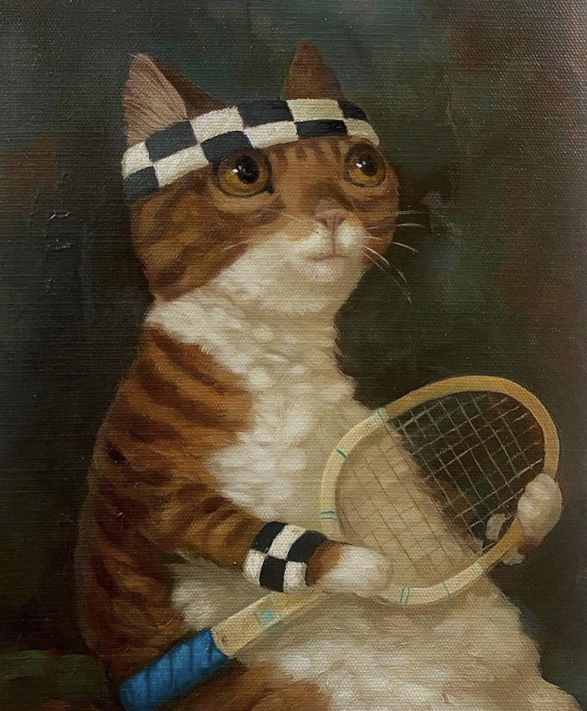
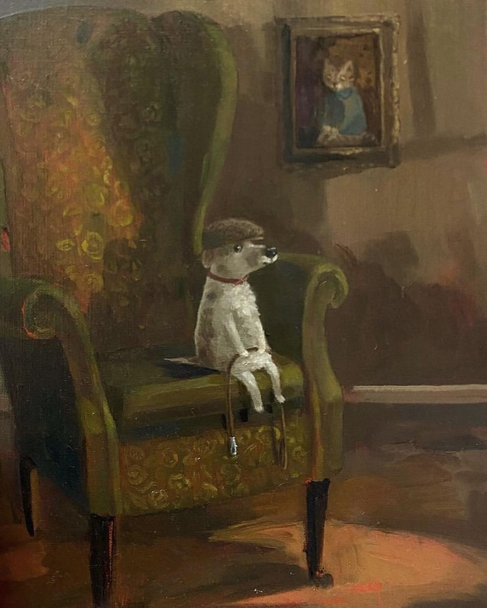
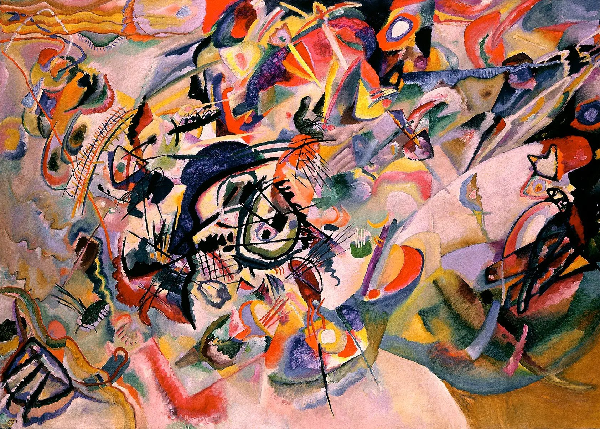

# A Neural Algorithm of Artistic Style Implementation

  
  
  

In this project, I implemented "A Neural Algorithm of Artistic Style" by Leon A. Gatys et al. and explored the results from varying hyper parameter configurations and methods.

## Overview
The artistic neural algorithm generates an image by propogating gradients down to the input image. Thus, the input image is learned as opposed to the network's weights by doing a gradient update with respect to the layer activations. Because only the input is trained, the weights of the pretrained model, VGG19, are frozen during training. The loss function is a weighted sum of the content and style losses.

  

Total Loss

Thus, two forward passes must be done before training to retrieve the style and content components from each of the model's convolutional layers to calculate the loss for the learned image during training.

## Implementation Details
In my implementation, I mostly followed what was on the original paper, however I made some adjustments which I will state here. I found that using MSE loss for both the content and style yielded the best results. Furthermore, for the style calculation, I normalized the gram matrix by dividing by the number of elements in it before it is passed into MSE. When using the loss functions (SSD) and without Gram matrix normalization (as outlined in the paper), my total loss exploded upwards to the hundred thousands for many iterations and had difficulty converging to a small loss. However, when using MSE for loss and gram matrix normalization, I was able to drive the loss down to <= 1 for all tests. The image seemed to converge around 500-600 training epochs. Another notable difference is that I omitted weights applied to each style loss layer when computing the total loss, as it helped with the issue stated previously.

As for the way I obtained the losses from each layer, I added content and style loss modules after the RELU layer that succeeds each convolutional layer of interest in VGG19 (which was imported with preinitialized weights using pytorch) in order to probe activation losses. It is necessary to put the loss modules after the RELU layer for the loss gradients to match the loss gradients presented in the paper. See the paper for more detail about the equations below.

  

Gradient of Content Loss

  

Gradient of Style Loss

The convolutional layers of interest in my implementation were conv1_1, conv2_1, conv3_1, conv4_1, and conv5_1. Additionally, I changed all max pool layers inside VGG19 to avg pool as the authors noted that avg pool seemed to work better. After each forward pass, I would calculate the appropriate loss using each module I added to VGG19. The optimizer I used was LBFGS. It is also worth noting that I froze the weights of VGG19 and put the model on eval mode while running gradient descent on the input image (as also mentioned in the paper). Finally, input normalization is not mentioned in the paper, however I found that adding a normalization layer as the first layer helped

Below are my best results. The gifs visualize the training process over 600 epochs. Each frame (aside from the first initial frame) is generated every 10 epochs. For the full report, see index.html.

  
  &nbsp; &nbsp; &nbsp; &nbsp;
  
  &nbsp; &nbsp; &nbsp; &nbsp;
  

  
&nbsp; &nbsp; &nbsp; &nbsp;
  
&nbsp; &nbsp; &nbsp; &nbsp;
  

  
&nbsp; &nbsp; &nbsp; &nbsp;
  
&nbsp; &nbsp; &nbsp; &nbsp;
  

  
&nbsp; &nbsp; &nbsp; &nbsp;
  
&nbsp; &nbsp; &nbsp; &nbsp;
  

Credits to Alison Friend for the cute animal portraits.
